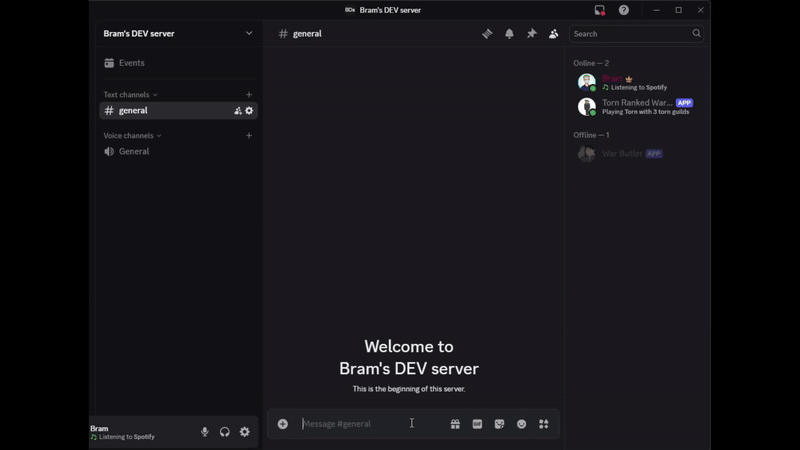
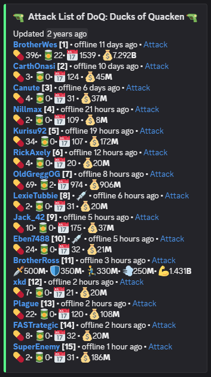
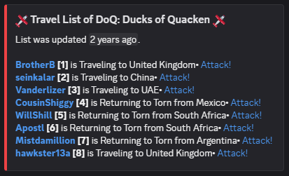

# No Longer in development

# RankedWarButler

Torn Discord Bot that assists in ranked wars.
\

## Installation

To invite the bot over to your discord server
click [here](https://discord.com/api/oauth2/authorize?client_id=932550905713270836&permissions=2147510288&scope=bot%20applications.commands).

\
At this moment the bot needs 5 rights
\

- `Manage Channels`
- `Send Messages`
- `Manage Messages`
- `Use Application Commands`
- `Embed Links`

### Setup

## Environment Variables

To run this project, you will need to add the following environment variables to your .env file

`BOT_TOKEN`
`DATABASE_URL`

## Commands

**Setup Butler** _Essential!_
\
Command: `/setup`
\
Description: Creates the RankedWar Butler Category and butler-dashboard

**Create Dashboard** _Essential!_
\
Command: `/dashboard`
\
Description: Command calls the torn rankedwars api and gives
information about the (upcomming) war. if no faction ID is given then it searches on own faction.
Note: Can only be called every 10 seconds

## Functionalities
- Ability to add Api Keys that will be used in monitoring of chosen factions
- Ability to add and track multiple factions
- Ability to submit spy stats that are used in the lists

**Hospital List**
An overview of members currently in the hospital, sorted in ascending order by discharge date — those scheduled to leave the hospital soonest appear at the top of the list.

**Attack list**
An overview of members currently available to attack. Each individual also has a direct link to its profile, making fast attacks easier. For each member in the list you can also see the available stats.

**Retalliation list**
List of members that can be retalliated on

**Flight tracker**
List of members that currently are flying inbound and outbound torn.

